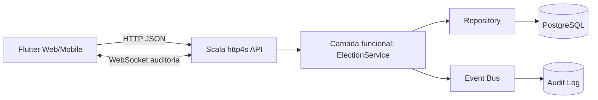

# Arquitetura — Sistema Eleitoral

## Paradigmas usados
- Programação funcional: Cats Effect IO, EitherT, modelos imutáveis e serviços puros.
- Event-driven: EventBus com eventos de auditoria como VoteCast e UserRegistered.
- Orientação a aspetos: middleware de logging/CORS e ponto preparado para auditoria transversal.
- Frontend web/mobile: Flutter corre em Android/iOS/Web/Desktop com a mesma base de código.
